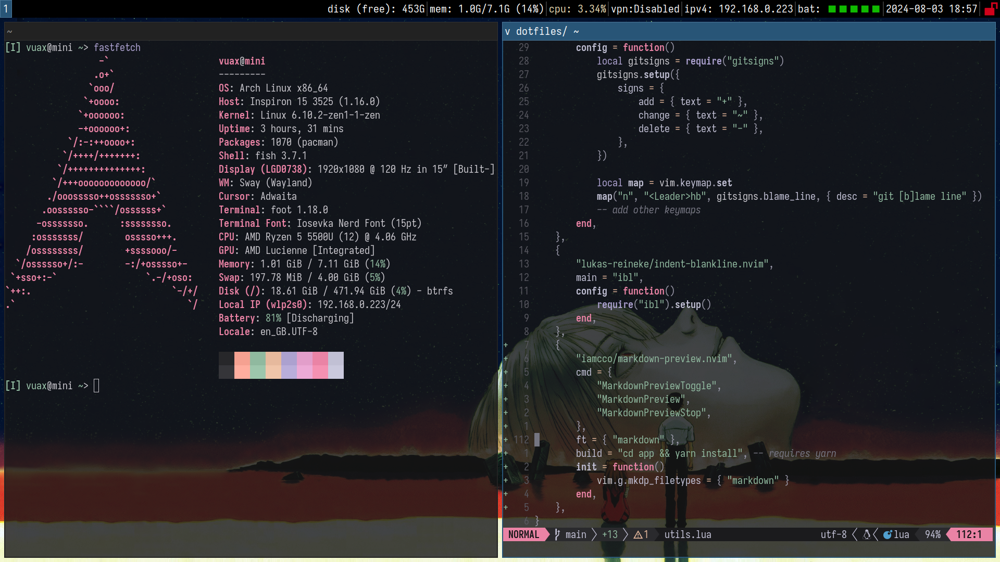

## install
Run the `install` script after succesfully installing Arch.\
Make sure to pacstrap `git`, to clone this repo.

After installing, run the `configure` script to copy over the configurations to `~/.config/*`
Reboot to ensure the configurations are loaded properly
## screenshots:

